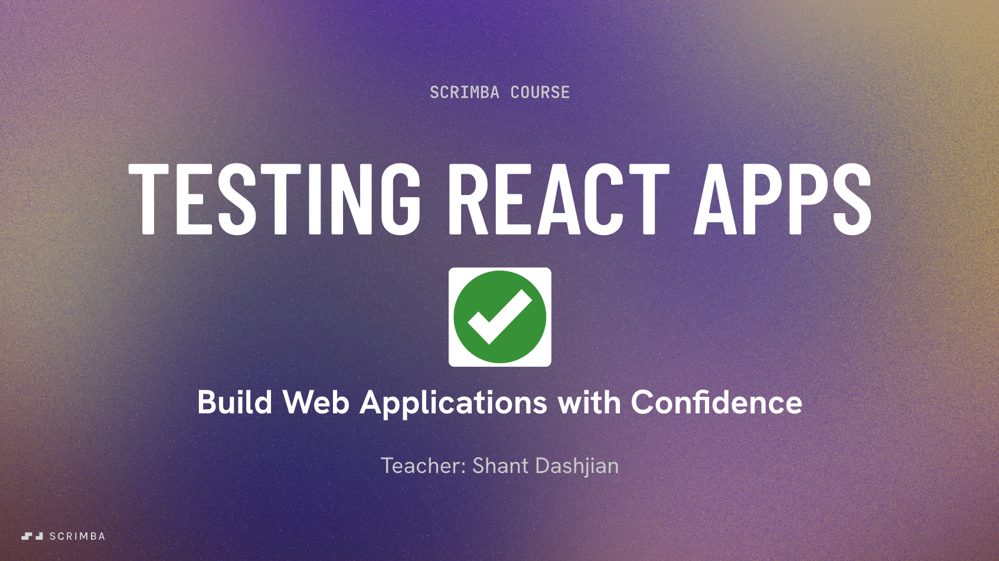

# Testing React Apps Course
My Testing React Apps course published on [Scrimba](https://scrimba.com/fullstack-path-c0fullstack/~03ha?coupon=SHANT50), as part of the [Fullstack Developer Path](https://scrimba.com/fullstack-path-c0fullstack).

## Course URL
- [Testing React Apps on Scrimba](https://scrimba.com/fullstack-path-c0fullstack/~03ha?coupon=SHANT50).
   
## About the Course
Want to ship React apps that are reliable, accessible, and bug-free? This course will teach you how to test your apps like a pro—so you can deploy with confidence, knowing everything works exactly as expected.

## What You Will Learn
1. Write and run tests
2. Structure and organize your test files
3. Test user interactions and async behavior
4. Mock external services
5. Measure test coverage
6. Practice accessibility-first testing
7. Apply Test-Driven Development (TDD)

## Prerequisites:
1. React fundamentals
2. Intermediate JavaScript (e.g. callbacks, async/await)
3. HTML & Web Accessibility concepts
4. Running code from the terminal
5. Working with npm and Vite